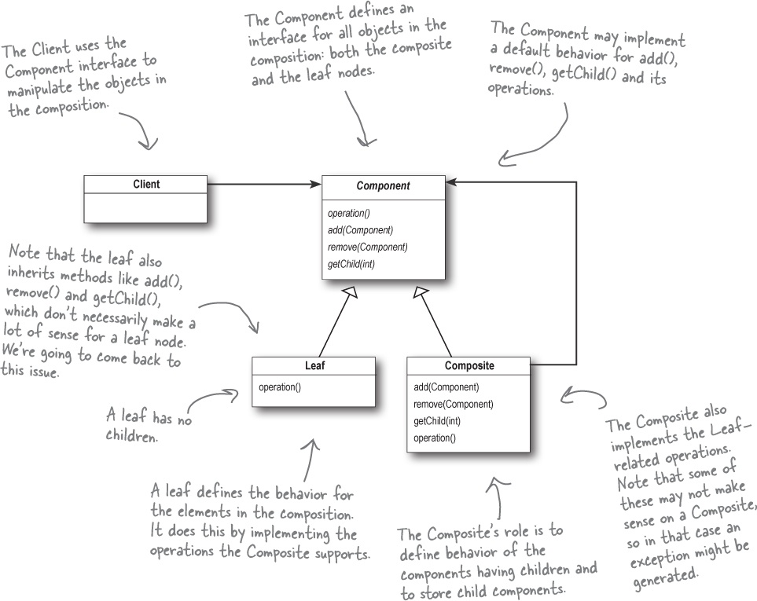

# 类图

# 定义

允许你将对象组合成树形结构来表现"整体/部分"层次结构.组合能让客户以一致的方式处理个别对象以及对象组合.

# 实现

1. 定义 `Component` 类:包含 `add`,`remove`,`getChild` 以及 `operations`(具体的各种操作).其中默认实现成抛出不支持错误.
2. 定义 `Leaf` 类继承 `Component` 类.重载`operations`具体的操作.leaf 类表示集合中的每一个元素.
3. 定义 `Composite`类继承`Component`类.重载 `add,remove,getChild`.表示 leaf 的组合.
4. 客户使用`Component对象`实现对组合或叶节点进行通用的操作.

# 抽象代码

    class Component {
      add() {
        throw new Error('不支持')
      }

      remove() {
        throw new Error('不支持')
      }

      getChild() {
        throw new Error('不支持')
      }

      operations() {
        throw new Error('不支持')
      }
    }

    class Leaf extends Component {
      operations() {
        // 叶节点具体操作
      }
    }

    class Composite extends Component {
      add() {
        // 添加叶节点
      }

      remove() {
        // 删除叶节点
      }

      getChild() {
        // 获取孩子叶节点
      }
    }

    class Client {
      constructor() {
        const component = new Component();
        const composite = new Composite();
        composite.add(new Leaf());
        composite.add(new Composite());
        component.add(composite);
        component.add(new Leaf());
        component.operations()
      }
    }

# 例子

场景描述: 实现一个菜单树,并可自动遍历.

代码: `composite.ts`
代码: `nav.ts`

# 适用场景

有整体/部分关系,树形结构

# 优缺点
