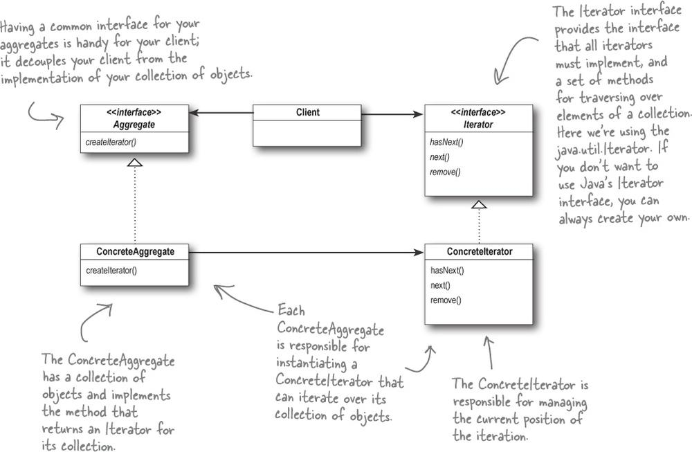

# 类图

# 定义

使用单独的对象实现对集合的遍历,无须暴露集合的实现.实现集合类和遍历的解耦.

# 实现

1. 定义 Iterator 接口:hasNext,next,remove;
2. 定义集合 Aggregate 接口:createIterator()
3. 具体的集合类实现 createIterator: 返回一个具体的 Iterator 对象,该对象通过持有集合内部需要遍历的元素实现遍历.
4. clinet 调用集合类的 createIterator 方法,使用返回的 Iterator 对象对集合进行遍历

# 抽象代码

    interface Iterator {
      hasNext():boolean;
      next():any;
      remove():void;
    }

    interface Aggregate {
      createIterator():Iterator;
    }

    class OneAggregate implement Aggregate {
      private items:any;
      createIterator() {
        return new OneIterator(items);
      }
    }

    class OneIterator implement Iterator {
      hasNext() {

      }

      next() {

      }

      remove() {

      }
    }
    class Client {
      constructor() {
        const oneAggregate:Aggregate = new OneAggregate();
        const oneIterator:Iterator = oneAggregate.createItearator();
        while (oneIterator.hasNext()) {
          const item = oneIterator.next()
          // item做一些操作
        }
      }
    }

# 例子

场景描述: 有汉堡王和肯德基两个菜单类,每个类持有一些菜单的集合,一个是 list,一个是 set.
通过实现集合类中的 createIterator 方法,返回统一的 Iterator 对象来个服务员类使用来进行统一的遍历.

代码: `iterator.ts`
